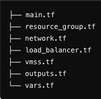

# Creating a Cluster of Web Servers with Azure VM Scale Set and Load Balancer

In this task, you will create a cluster of web servers by provisioning the necessary infrastructure using Terraform. You will create an Azure Virtual Machine Scale Set (VMSS) and a load balancer to distribute traffic across your web servers. The web servers will return "Hello, World" for the URL /, and the load balancer will listen on port 80.

## Prerequisites

To complete this task, you must have Terraform and Azure CLI installed and configured on your machine.

## Steps to Complete the Task

**1. Fork this Repository**

**2. Set Up Structure**

**3. Define Configuration Files**

#### main.tf
- Set the Azure provider source and version.

#### resource_group.tf
- Define a resource group with a specific name and location (e.g., "West Europe").

#### network.tf
- Define a virtual network with a CIDR block of "10.0.0.0/16".
- Create a subnet within this virtual network with a CIDR block of "10.0.2.0/24".

#### load_balancer.tf
- Create a public IP with a static allocation method.
- Define a load balancer and associate it with the public IP.
- Create a backend address pool for the load balancer.
- Define a health probe for the load balancer, listening on the port specified in the vars.tf file.
- Create a load balancer rule to direct traffic on port 80 to the backend pool.

#### vmss.tf
- Define a virtual machine scale set with the following properties:
    * Name, location, and resource group.
    * SKU of "Standard_B1s" and 2 instances.
    * Admin username and password.
    * Source image reference for Ubuntu Server 18.04 LTS.
    * OS disk type set to "Standard_LRS".
    * Network interface with the primary IP configuration set to the subnet and load balancer backend pool.
- Add a VM extension to run a custom script to serve "Hello, World" on the specified port.

**4. Define Outputs and Variables**

- Use a datasource to retrieve the public IP address of the load balancer.
- Define an output to display this public IP address.
- Define a variable for the server port with a description and a default value of 80. 

**5. Initialize and Apply the Configuration**

**6. After deploy don't forget to delete all resources**

**7. Pull request's description should also contain a reference to a successful workflow run**